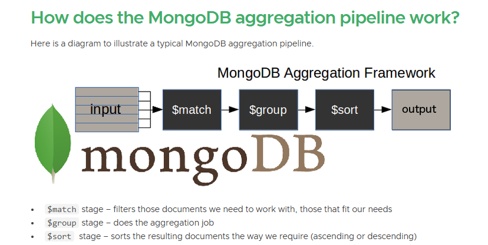

# Mastering-MongoDB-Aggregation-And-Indexing

Practice Data: https://github.com/Apollo-Level2-Web-Dev/mongodb-practice

In This Module, You'll Be Introduced To The Robust Aggregation Framework In MongoDB. Gain An Understanding Of How This Framework Empowers Advanced Data Processing And Manipulation, Providing A Flexible And Efficient Approach To Data Analysis Within MongoDB.

What Will You Learn From This Module?

0. Introduction of a powerful aggregation framework: Dive into the world of data manipulation with the powerful Aggregation Framework. We'll explore how it allows you to process, group, and summarize data from your MongoDB collections.

1. $match , $project aggregation stage: Dive into the $match and $project aggregation stages. Learn how $match filters documents based on specified criteria, while $project enables reshaping by including or excluding fields.

2. $addFields , $out , $merge aggregation stage:Explore the $addFields, $out, and $merge aggregation stages. Understand how to add new fields, write results to a new collection overwrite an existing one, and merge results into an existing collection.

3. $group , $sum , $push aggregation stage: Delve into the $group aggregation stage, allowing grouping by a specified key. Learn to use $sum to calculate the sum within a group and $push to create arrays of values.

4. explore more about $group & $project: Further, explore the capabilities of $group and $project aggregation stages. Understand advanced techniques in grouping and reshaping data for specific analysis requirements.

5. Explore $group with $unwind aggregation stage: Discover the $group aggregation stage combined with $unwind. Learn how to handle arrays within documents, facilitating more complex aggregations.

6. $bucket, $sort, and $limit aggregation stage: Explore the $bucket aggregation stage for categorizing data, $sort for sorting results, and $limit for limiting document output.

7. $facet, multiple pipeline aggregation stage: Dive into the $facet aggregation stage, enabling the execution of multiple pipelines within a single stage. Understand how this feature facilitates parallel processing of various aggregations.

8. $lookup stage, embedding vs referencing: Explore the $lookup aggregation stage for performing left outer joins between collections. Understand the concepts of embedding and referencing for efficient data modeling.

9. What is indexing, COLLSCAN vs IXSCAN: Learn about indexing in MongoDB, its importance in optimizing query performance, and the distinction between COLLSCAN (Collection Scan) and IXSCAN (Index Scan).

10. Explore compound index and text index: Delve into compound indexes, involving multiple fields, and text indexes designed for efficient text searching. Understand how these indexes enhance query efficiency.

Embark on this journey to master MongoDB Aggregation and enhance your data manipulation and analysis skills within the MongoDB environment! Happy learning!

## 16-0 Intro the powerful aggregation framework


- Aggregation Is The way of processing a large number of documents in a collection by means of passing them through different stages.
- The stages make up what is known as pipeline
- The stages in a pipeline can filter, sort, group, reshape and modify documents that passes through the pipeline
- The aggregation pipeline is often preferred and the recommended way of doing aggregations in MongoDB. It is designed specifically to improve performance and usability for aggregation. Pipeline operators need not produce one output document for every input document, but can also generate new documents or filter out documents. Moreover, starting from MongoDB version 4.4, it can also define custom aggregation expressions with $accumulator and $function.

#### Lets Understand with an example

- Suppose You have 8 cousins. You are planning to do tour. Before the tour date suppose some have exam, some arises with financial issues and some became sick


- Just 3 Cousins are left. Here Big Brother will manage all tour related things. For this `Sort By Age` will be done to make the big brother the leader.
- Suppose Before the Tour Date Another Occurrence happened like you just got 2 ticket. The problem is there is no chance to change the tour date. So we have do `limit by two` and remove the younger one.


- Then the two cousins are put in a `group` and calculated the budget.


- here, sor, limit, group is done in different stages. These are called aggregation.

#### Syntax Of Aggregation

```js
db.collection.aggregate([
  // stage-1
  {}, //---->pipeline
  // stage-2
  {}, //---->pipeline
  // stage-3
  {}, //---->pipeline
]);
```


- One Stage Will Pass the data to another stage.


```js
db.cousins.aggregate([
  // filter out the cousins who have exam
  { $match: { hasExam: { $ne: true } } },

  // Filter out cousins who have a budget less than 5000
  { $match: { budget: { $gte: 5000 } } },

  // filter out cousins who is sick
  { $match: { isSick: false } },

  // sort by age
  { $sort: { age: -1 } },

  // limit by 2
  { $limit: 2 },

  // calculate budget
  {
    $group: {
      _id: "null",
      totalBudget: { $sum: "$budget" },
      cousins: { $push: "$name" },
    },
  },
]);
```

#### Most Commonly Used Aggregation are

- $project: Reshapes each document in the stream, e.g., by adding new fields or removing existing fields. For each input document, output one document.
- $match: Filters the document stream to allow only matching documents to pass unmodified into the next pipeline stage. For each input document, the output is either one document (a match) or zero document (no match).
- $group: Groups input documents by a specified identifier expression and apply the accumulator expression(s), if specified, to each group. $group consumes all input documents and outputs one document per each distinct group. The output documents only contain the identifier field (group id) and, if specified, accumulated fields.
- $sort: Reorders the document stream by a specified sort key. The documents are unmodified, except for the order of the documents. For each input document, the output will be one document.
- $skip : Skips the first n documents where n is the specified skip number and passes the remaining documents unmodified to the pipeline. For each input document, the output is either zero document (for the first n documents) or one document (after the first n documents).
- $limit : Passes the first n documents unmodified to the pipeline where n is the specified limit. For each input document, the output is either one document (for the first n documents) or zero document (after the first n documents).
- $unwind : Breaks an array field from the input documents and outputs one document for each element. Each output document will have the same field, but the array field is replaced by an element value per document. For each input document, outputs n documents where n is the number of array elements and can be zero for an empty array.

## 16-1 $match , $project aggregation stage

[Mongodb Aggregation](https://studio3t.com/knowledge-base/articles/mongodb-aggregation-framework/)



#### $match stage

- The $match stage allows us to choose just those documents from a collection that we want to work with. It does this by filtering out those that do not follow our requirements.

- aggregate is similar to find

```js
db.test.find({});
```

```js
db.test.aggregate([]);
```

##### Implementing single condition

```js
db.test.find({ gender: "Male" });
```

```js
db.test.aggregate([
  // stage-1
  { $match: { gender: "Male" } },
]);
```

- We can Implement Multiple condition

```js
db.test.find({ gender: "Male", age: { $lt: 30 } });
```

```js
db.test.aggregate([
  // stage-1
  { $match: { gender: "Male", age: { $gt: 30 } } },
]);
```

#### $project stage

- In MongoDB, the $project aggregation stage is used to shape the structure of the documents that result from a pipeline. Same as Field Filtering

```js
db.test
  .find({ gender: "Male", age: { $lt: 30 } })
  .project({ name: 1, gender: 1, age: 1 });
```

```js
db.test.aggregate([
  // stage-1
  { $match: { gender: "Male", age: { $gt: 30 } } },

  // stage-2
  { $project: { name: 1, age: 1, gender: 1 } },
]);
```

- Lets Make a twist here

```js
db.test.aggregate([
    // stage-1
        {$project:{name:1,gender:1}}

    // stage-2

    { $match: { gender: "Male", age:{$gt : 30 } }},
])
```

- This will not show any document (empty array) since first stage is not passing the age to the second stage but there is work related to age and which is under implicit and condition.

- For this reason we will use project at the end of all stages so that no hassle occurs.
